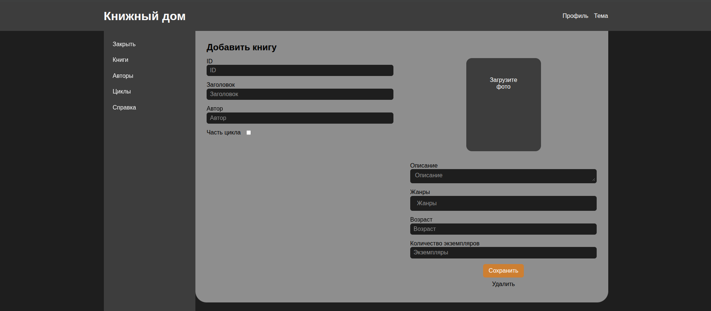

# Книжный дом | Панель управления

В данном проекте реализована панель управления для сайта **Книжный дом**.  
Основная задача админки — создание и редактирование данных о книгах, авторах, циклах и тд (классический CRUD).  
В будущем планируется добавить редактирование данных о пользователях.  

Сайт расположен на [es-libris.ru](https://es-libris.ru)



<!-- ## Как посмотреть

Вы можете посмотреть сайт в гостевом режиме. Для этого авторизуйтесь на [es-libris.ru](https://es-libris.ru) с логином "LOGIN" и паролем "PASSWORD".

```
  LOGIN PASSWORD
``` -->

## Структура проекта

### Фронтенд

- Написан на React + TypeScript
- Структура файлов по FSD
- Сборщик Vite

### Бэкенд

- Написан на Node.js + Express.js + TypeScript
- Данные хранятся в .json-файлах, в будудущем планируется MySQL/PostgreSQL

## Как запустить

Скачать проект Вы можете с помощью:

```
git clone https://github.com/SealSergio/library-admin.git
```

Запуск бэкенда:
```
cd backend && npm install && npm run dev
```

Запуск фронтенда:
```
cd frontend && npm install && npm run dev
```


## Методологии и codestyle

Для управления проектом используются методологии GitHub Flow, Conventional Commits, Semantic Versioning. Подробнее в [CONTRIBUTING.md](CONTRIBUTING.md).

## О сервере

Проект запущен на сервере ubuntu + nginx + pm2.
